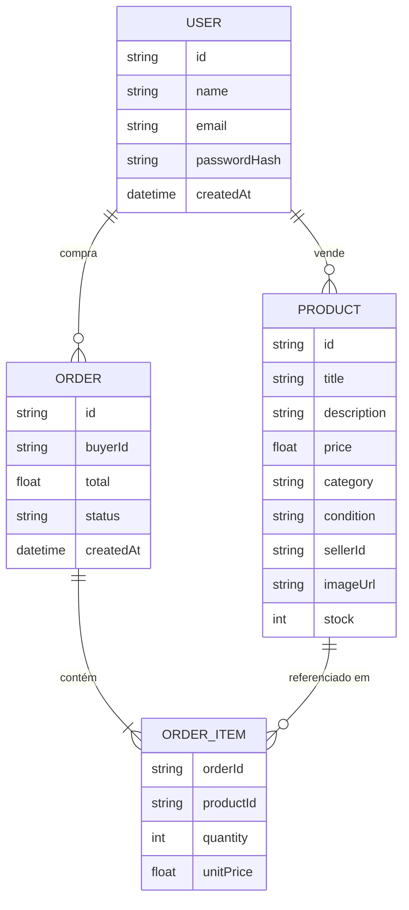
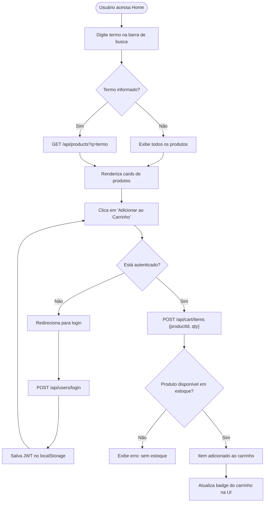

# Diagramas — Express Commerce

## Diagrama ER (Entidade-Relacionamento)

Entidades centrais: **Usuário**, **Produto**, **Pedido** e **Item de Pedido**.

---

## Diagrama de Fluxo — Busca e Adicionar ao Carrinho

Fluxo completo do usuário desde a busca de um produto até a adição ao carrinho.

